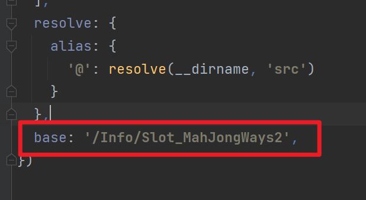
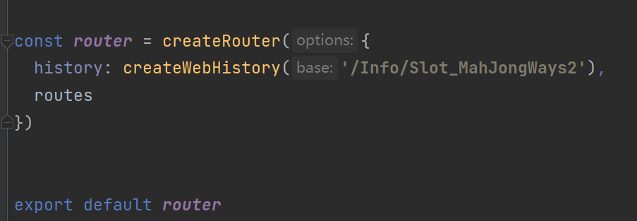

### 主要技术栈
+ Vue3.x
+ Vite2.x
+ Vant4.x
+ Typescript
+ Pinia

<br/>

## 开发
### 安装依赖

```bash
# with npm
npm install
# or with yarn
yarn
```
### 启动
```bash
# with npm
npm run dev
# or with yarn
yarn dev
```
### 本地打包
```bash
# with npm
npm run build
# or with yarn
yarn build
```
修改打包路径 
```bash
vite.config.ts  文件中  base

router/index.ts 文件中 createWebHistory的参数

```
